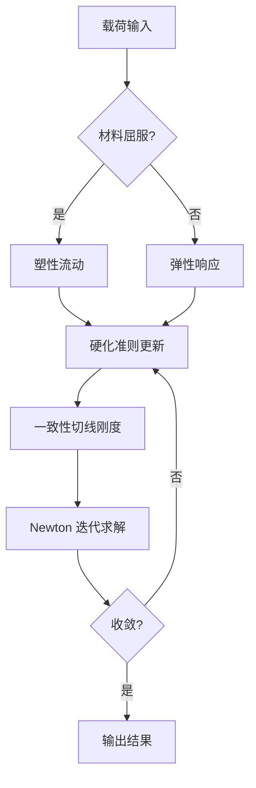
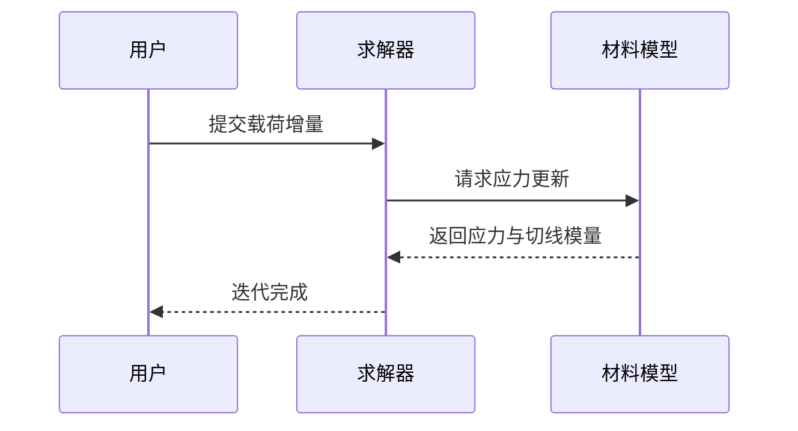
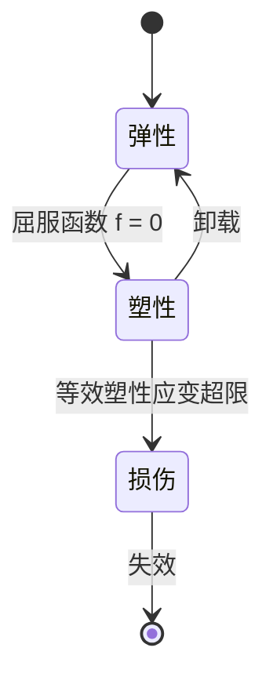
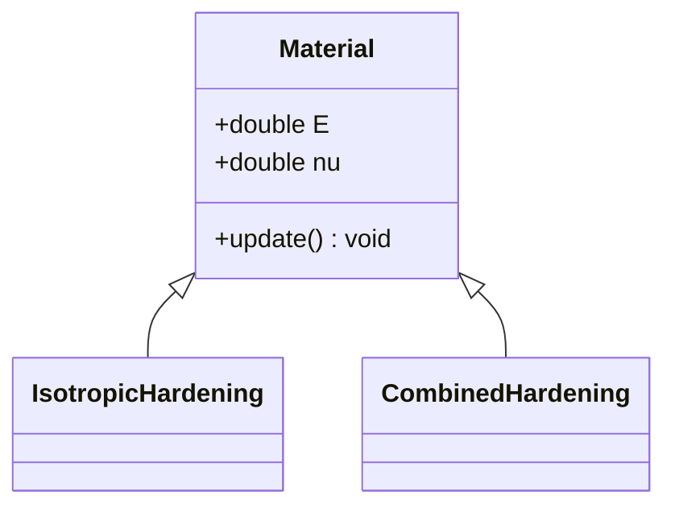
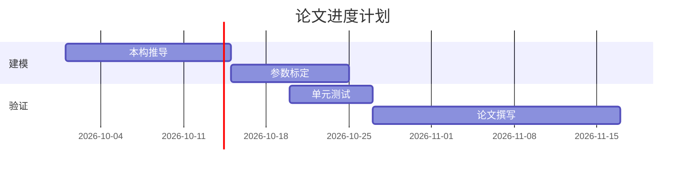
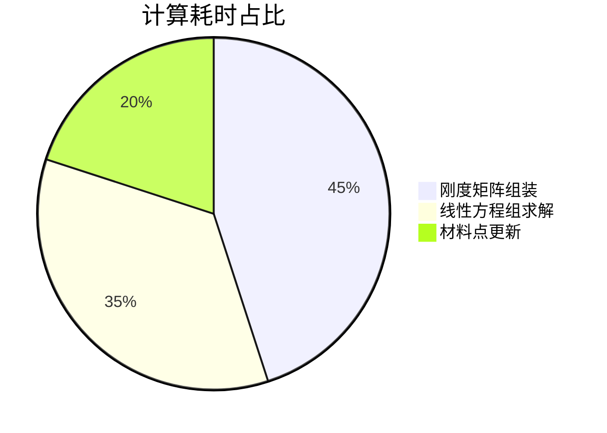

# MarkdownX 图表与公式验证文档

> 本文档用于验证 MarkdownX v1.7.0 的文本绘图（Text-to-Diagram）与公式排版功能。
> 建议使用 **沉浸排版视图** 阅读（`Ctrl + /` 切换），逐节核对下方每一项。

---

## 1. 流程图 (flowchart)

应力—应变分析的标准流程。图表内使用**中文字符**与**希腊字母**：



## 2. 时序图 (sequenceDiagram)



## 3. 状态图 (stateDiagram-v2)



## 4. 类图 (classDiagram)



## 5. 甘特图 (gantt)



## 6. 饼图 (pie)



---

## 7. 无标注围栏自动识别

下方代码块**故意不写** `mermaid` 语言标记，程序应自动识别为图表：

```
flowchart LR
  K[刚度矩阵 K] --> U[位移 u]
  U --> F[内力 f = Ku]
```

---

## 8. 公式编号与交叉引用

行内公式：弹性模量 $E$ 与泊松比 $\nu$ 描述各向同性弹性。

带编号的块级公式：

$$
\sigma_{ij} = C_{ijkl} \varepsilon_{kl} \tag{1}
$$

自动编号（由 `\label` 触发）：

$$
C_{ijkl} = \lambda \delta_{ij} \delta_{kl} + \mu (\delta_{ik}\delta_{jl} + \delta_{il}\delta_{jk}) \label{eq:stiffness}
$$

点击下方引用应平滑跳转至上式：

- 带括号引用：见式 $\eqref{eq:stiffness}$
- 裸编号引用：见式 $\ref{eq:stiffness}$
- 故意引用了不存在的标签（应显示红色 `(?)`）：$\eqref{eq:notexist}$

---

## 9. 学术三线表

| 材料 | 弹性模量 $E$ (GPa) | 泊松比 $\nu$ | 屈服强度 (MPa) |
|:---|---:|---:|---:|
| Q235 钢 | 206 | 0.30 | 235 |
| 6061-T6 铝 | 68.9 | 0.33 | 276 |
| Ti-6Al-4V | 113.8 | 0.34 | 880 |

## 10. 定理与提示卡片

> [!THEOREM] 最小势能原理
> 在所有满足位移边界条件的许可位移场中，真实位移场使系统总势能取驻值。

> [!ASSUMPTION] 小变形假定
> 位移梯度远小于 1，应变张量采用小应变定义 $\varepsilon_{ij} = \frac{1}{2}(u_{i,j} + u_{j,i})$。

> [!WARNING] 网格敏感性
> 损伤模型存在网格依赖性，需引入正则化方法。

## 11. 代码块（含 LaTeX 源码，不应被公式引擎改写）

```python
import numpy as np

def assemble_stiffness(coords, E, nu):
    """组装平面单元刚度矩阵"""
    # 材料矩阵 D
    D = E / (1 - nu**2) * np.array([[1, nu, 0],
                                    [nu, 1, 0],
                                    [0, 0, (1 - nu) / 2]])
    return D
```

```latex
\begin{equation}
  \rho \ddot{\mathbf{u}} = \nabla \cdot \boldsymbol{\sigma} + \mathbf{b}
\end{equation}
```

上方 LaTeX 代码块中的 `$$` 与 `\begin{equation}` 应**原样显示**，不得变为渲染后的公式。

---

## 12. 未闭合围栏的保守行为演示

下方代码块**故意缺少结尾的三个反引号**。程序**不应**猜测图表边界，而应原样显示为代码块并给出提示：

```mermaid
flowchart TD
  A[未闭合示例] --> B[应显示为代码块]
这里混入了正文文字，不应被当作图表源码静默裁剪。
