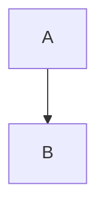

# 公式与引用

行内 $a^2+b^2=c^2$，另一种定界符 \(x \to 0\)。

$$\mathcal{F} = \tfrac{1}{2} K_1 (\nabla \cdot \boldsymbol{n})^2 \label{eq:frank}$$

见 \eqref{eq:frank} 与 \ref{eq:frank}。再来一个：

\[ E = mc^2 \]

## 代码围栏

```python
def f(x):
    return x ** 2  # $$ not math here
```



> 引用块
> 第二行

- 列表项一
- 列表项二
  - 嵌套项
